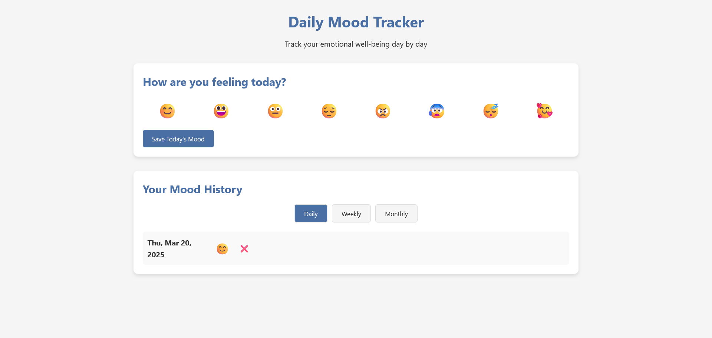
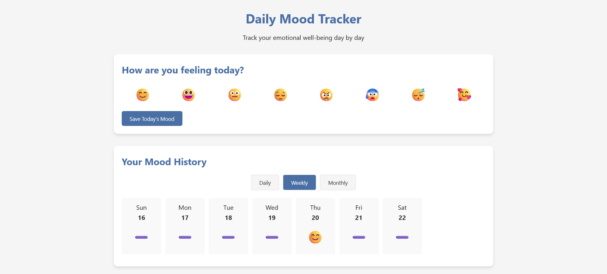
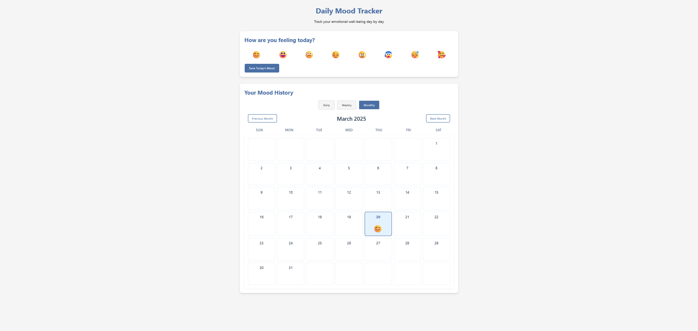

# **Daily Mood Tracker**

A beautiful and intuitive web application to track your daily emotional well-being. This project helps you monitor your mood patterns over time with an easy-to-use interface and multiple visualization options.

## 🌟 Features

- **Mood Selection**: Choose from 8 different emotions using emoji buttons
- **Multiple View Options**:
  - Daily view for quick mood entries
  - Weekly view for pattern analysis
  - Monthly calendar view for long-term tracking
- **Responsive Design**: Works seamlessly on both desktop and mobile devices
- **Local Storage**: Your mood data is saved locally in your browser
- **Beautiful UI**: Clean and modern interface with smooth animations

## 🚀 Live Demo

[View Live Demo](https://mood-trackeer.netlify.app/)

## 📸 Screenshots





## 🛠️ Technologies Used

- HTML5
- CSS3
- JavaScript (Vanilla)
- Local Storage API

## 🏃‍♂️ Getting Started

1. Clone the repository:

   ```bash
   git clone https://github.com/naitikprajapati1/MoodTracker
   ```

2. Navigate to the project directory:

   ```bash
   cd mood-tracker
   ```

3. Open `index.html` in your web browser or use a local server.

## 📱 Usage

1. Select your current mood by clicking on one of the emoji buttons
2. Click "Save Today's Mood" to record your mood
3. View your mood history using the different view options:
   - Daily view shows your recent mood entries
   - Weekly view provides a summary of your mood patterns
   - Monthly view displays a calendar with your mood history

## 🤝 Contributing

Contributions are welcome! Please feel free to submit a Pull Request.

## 👤 Author

Naitik Prajapati

- GitHub: [@naitikprajapati01](https://github.com/naitikprajapati1/)
- Email: naitikprajapti383@gmail.com

---

Made with ❤️ for better emotional well-being
